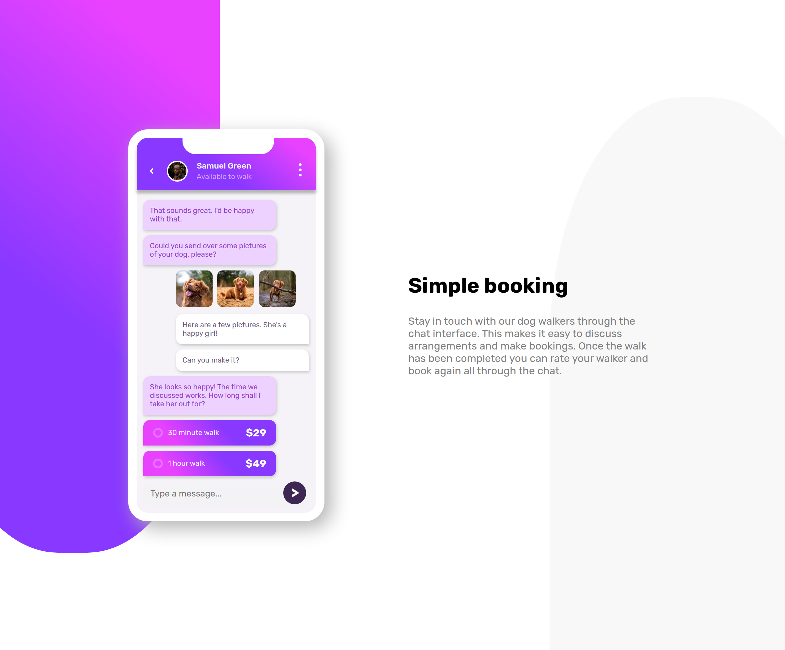
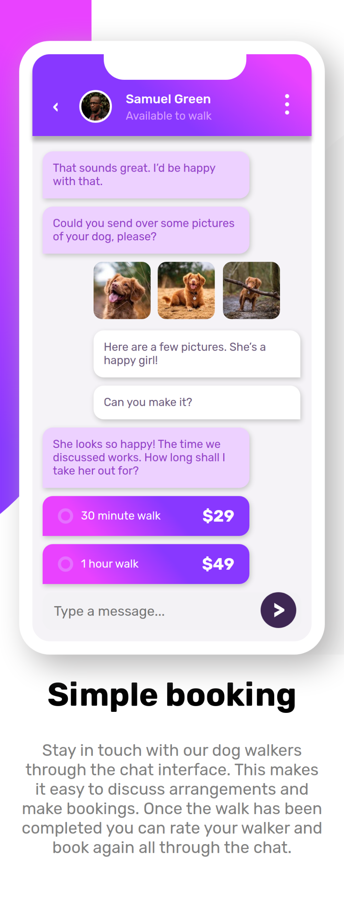

# ChatAppIllustration
A frontend mentor challenge to use HTML, CSS to make a chat app illustration.

[Live Demo] -> https://luizabarros.github.io/chat-app-illustration/

# Frontend Mentor - Chat app CSS illustration

[Design preview for the Chat app CSS illustration coding challenge]

### Desktop Version

### Mobile Version

## 🚀 Starting

To start the project, just open the file `index.html` in your preferred browser.

## Welcome! 👋

Thanks for checking out this front-end coding challenge.

[Frontend Mentor](https://www.frontendmentor.io) challenges allow you to improve your skills in a real-life workflow.

**To do this challenge, you need a strong understanding of HTML and CSS.**

## The challenge

Your challenge is to build out this feature illustration using HTML & CSS and get it looking as close to the design as possible.

The only assets we provide in this challenge are the image of the person in the app UI and the 3 images of the dog. You need to create everything else using HTML & CSS!
